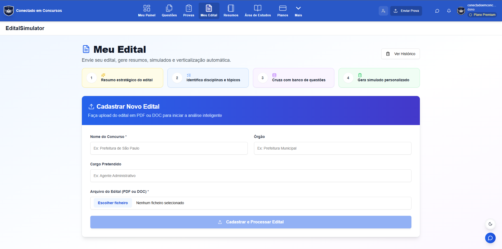

<p align="center">
  
</p>

<h1 align="center">Conectado em Questões</h1>

<p align="center">
  Plataforma de estudos para concursos públicos, com questões, simulados, provas, planos de estudo e gestão de conteúdos.
</p>

<p align="center">
  <a href="https://github.com/guedes-jr/Django-Nextjs_ConectadoEmConcursos">Repositório no GitHub</a>
</p>

## Visão do produto


O sistema reúne uma experiência de estudo para alunos e uma área administrativa para operação de questões, provas, conteúdos, assinaturas e relatórios.

| Estudo e aprendizagem | Gestão e operação |
| --- | --- |
| Banco de questões, filtros, favoritos e revisão | Administração de usuários, planos e assinaturas |
| Simulados com correção e acompanhamento | Fontes externas, fila de revisão e publicação de questões |
| Planos de estudo, cronogramas e ciclos | Conteúdos editoriais, auditoria, notificações e diagnósticos |

## Recursos em destaque



- Questões de concursos com filtros por disciplina, banca, ano e progresso.
- Simulados, cadernos, anotações, flashcards, resumos e relatórios de desempenho.
- Planos de estudo por trilha, cronograma ou ciclo.
- Acervo de provas e gerenciamento editorial pelo painel administrativo.
- Backend Django/DRF e frontend Next.js App Router.

## Tecnologias

- **Frontend:** Next.js 16, React 19, TypeScript e Tailwind CSS.
- **Backend:** Django 5, Django REST Framework e Django Q.
- **Dados locais:** SQLite por padrão durante o desenvolvimento.
- **Produção:** serviços Django e Next.js independentes.

## Instalação local

Escolha o tutorial adequado ao seu sistema operacional. Os guias começam pela instalação das ferramentas, passam pela configuração inicial do Git e terminam com a aplicação aberta no navegador.

- [Windows — instalação local passo a passo](docs/instalacao-windows.md)
- [macOS — instalação local passo a passo](docs/instalacao-macos.md)
- [Linux (Ubuntu/Debian) — instalação local passo a passo](docs/instalacao-linux.md)

> O desenvolvimento local usa SQLite por padrão. Os tutoriais também explicam a instalação opcional do PostgreSQL para uso futuro.

## Endereços locais

Depois de iniciar os dois servidores:

- Frontend: <http://localhost:3000>
- API/Django: <http://localhost:8000>
- Django Admin: <http://localhost:8000/admin/>

## Comandos úteis

Em macOS/Linux, na raiz do repositório, o `Makefile` oferece atalhos como:

```bash
make setup
make backend
make frontend
make check
make typecheck
```

No Windows, siga os comandos diretos do [guia de Windows](docs/instalacao-windows.md), pois `make` não vem instalado por padrão.

## Estrutura principal

```text
backend/     # Django, API REST, regras de negócio e migrations
frontend/    # Next.js, páginas, componentes e interface
docs/        # Documentação operacional e tutoriais de instalação
```

## Contribuição

1. Crie uma branch a partir de `main`.
2. Faça alterações pequenas e verificáveis.
3. Rode as validações adequadas antes do commit.
4. Não envie arquivos `.env`, bancos locais, chaves ou outros dados sensíveis.
