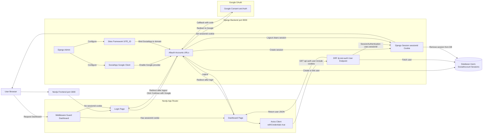

# Django + Next.js — ConectadoEmQuestoes

Projeto fullstack com backend Django (DRF + dj-rest-auth + allauth) e frontend Next.js (App Router). Este README descreve como rodar e configurar localmente, incluindo Google OAuth.

## Estrutura principal
- backend/ — Django project
- frontend/ — Next.js (app router)
- docs/ — instruções (ex: Google_Oauth.md)
- backend/db.sqlite3 — banco SQLite (dev)
- backend/keys/ — chaves locais (não versionar)

## Pré-requisitos
- Python 3.10+
- Node.js 16+
- npm / yarn
- Google Cloud Console (para OAuth)

## Arquivos importantes de configuração
- backend/config/settings/base.py — settings (SITE_ID, CORS, JWT cookies)
- frontend/lib/http.ts (ou /lib/api.ts) — cliente axios com withCredentials
- .env / .env.local — variáveis locais (não commitar)

## Variáveis de ambiente (exemplos)
- DJANGO_SECRET_KEY
- DJANGO_ENV=development
- DJANGO_ALLOWED_HOSTS=localhost,127.0.0.1
- CORS_ALLOWED_ORIGINS=http://localhost:3000
- CSRF_TRUSTED_ORIGINS=http://localhost:3000
- FRONTEND_URL=http://localhost:3000
- NEXT_PUBLIC_API_BASE_URL=http://localhost:8000
- OPENAI_API_KEY (opcional; sem chave ou sem plano elegível, usa assistência local)
- OPENAI_MODEL=gpt-5.4-mini
- EMAIL_BACKEND (console no desenvolvimento; SMTP/API em produção)

Em produção, use `DJANGO_ENV=production`. Nesse ambiente, segredo, hosts,
CORS e origens CSRF são obrigatórios, e os cookies/redirects HTTPS são
habilitados automaticamente.

## Setup — Backend
```bash
# filepath: /home/junior/Projects/Django-Nexjs_ConectadoEmQuestoes/readme.md
# entrar na pasta backend e criar venv (se precisar)
cd backend
python3 -m venv venv
source venv/bin/activate
pip install -r requirements.txt

# migrar e criar superuser
python manage.py migrate
python manage.py createsuperuser
```

## Setup — Frontend
```bash
# filepath: /home/junior/Projects/Django-Nexjs_ConectadoEmQuestoes/readme.md
cd frontend
npm install
# ou
yarn
```

## Rodando localmente
- Backend:
```bash
# filepath: /home/junior/Projects/Django-Nexjs_ConectadoEmQuestoes/readme.md
cd backend
source venv/bin/activate
python manage.py runserver
```
- Frontend:
```bash
# filepath: /home/junior/Projects/Django-Nexjs_ConectadoEmQuestoes/readme.md
cd frontend
npm run dev
# ou yarn dev
```

## Acesso de demonstração (ambiente local)

No banco local `backend/db.sqlite3`, use estas credenciais na tela de login:

- **E-mail:** `demo@conectado.local`
- **Usuário:** `demo.questoes`
- **Senha:** `Demo@Concursos2026!`

O banco SQLite é ignorado pelo Git. Em uma instalação nova, crie o usuário de demonstração após executar as migrações:

```bash
cd backend
.venv/bin/python manage.py shell -c "from django.contrib.auth import get_user_model; User = get_user_model(); user, _ = User.objects.get_or_create(username='demo.questoes', defaults={'email': 'demo@conectado.local'}); user.email = 'demo@conectado.local'; user.set_password('Demo@Concursos2026!'); user.save()"
```

Essas credenciais são destinadas somente ao desenvolvimento local.

## Importar questões

Após aplicar as migrações, importe o XML exportado com:

```bash
cd backend
.venv/bin/python manage.py migrate
.venv/bin/python manage.py import_content /caminho/para/questoes.xml --dry-run
.venv/bin/python manage.py import_content /caminho/para/questoes.xml
```

O importador também aceita JSON e CSV. A importação do XML usa o ID de origem para atualizar questões existentes sem criar duplicatas.

## Google OAuth (passos resumidos)
1. No Google Cloud Console → APIs & Services → Credentials → Create OAuth client (Web application).
2. Authorized JavaScript origins:
   - http://localhost:8000
   - http://localhost:3000
3. Authorized redirect URIs (adicionar exatamente):
   - http://localhost:8000/accounts/google/login/callback/
   - (opcional) http://localhost:8000/api/auth/google/callback/
4. Copiar Client ID/Secret.
5. No Django admin → Social applications:
   - Provider: Google
   - Adicionar Client ID e Secret
   - Associar ao Site (domain `localhost:8000`, id=1)

Erro comum: `redirect_uri_mismatch` — significa que o redirect_uri enviado não está cadastrado exatamente no OAuth client. Copie o redirect_uri exibido no erro e adicione-o à lista de Authorized redirect URIs.

## Cookies, CORS e autenticação
- O backend já tem:
  - CORS_ALLOW_CREDENTIALS = True
  - CORS_ALLOWED_ORIGINS deve incluir `http://localhost:3000`
  - CSRF_TRUSTED_ORIGINS incluir `http://localhost:3000`
- Frontend deve usar axios/fetch com credenciais:
  - axios: withCredentials: true
  - fetch: credentials: "include"
- Recomenda-se checar /api/auth/user/ do backend para validar sessão.

## Frontend — exemplo rápido (autenticação)
- Cliente axios com cookies:
```ts
// filepath: /home/junior/Projects/Django-Nexjs_ConectadoEmQuestoes/readme.md
import axios from "axios";

const http = axios.create({
  baseURL: process.env.NEXT_PUBLIC_API_BASE_URL || "http://localhost:8000",
  withCredentials: true,
  headers: { "Content-Type": "application/json" },
});

export { http };
```

## Endpoints úteis
- Iniciar OAuth Google (allauth): `/accounts/google/login/` ou `/api/auth/google/`
- Callback: `/accounts/google/login/callback/` ou `/api/auth/google/callback/`
- Usuário autenticado (drf + dj-rest-auth): `/api/auth/user/`
- Logout: `/accounts/logout/`

## Planejamento de estudos

Acesse `/study` após o login. Escolha objetivo, disciplinas, dias disponíveis e minutos por dia; a data da prova é opcional. A página cria atividades de teoria, questões e revisão, mostra até três próximos passos e permite registrar tempo, mover atividades e redistribuir pendências. Dez respostas de uma disciplina no dia concluem automaticamente o bloco correspondente de questões. O desempenho semanal é calculado a partir das respostas já registradas na plataforma.

O plano fica salvo na conta do usuário. A API autenticada usa `GET/POST/PATCH/DELETE /api/study-plan/`, `PATCH /api/study-plan/blocks/{id}/`, `POST /api/study-plan/blocks/{id}/sessions/` e `POST /api/study-plan/replan/`. Execute `python manage.py migrate` para criar as tabelas.

## Troubleshooting rápido
- SocialApp.DoesNotExist: criar Social Application no Admin e associar Site id=1.
- redirect_uri_mismatch: adicionar redirect_uri exato no Google Console.
- Cookies não enviados: verificar withCredentials, CORS_ALLOW_CREDENTIALS e SameSite/secure dos cookies.
- Se usar SameSite=None, o cookie precisa Secure (HTTPS) — em dev prefira Lax.

## Git
- Há um .gitignore na raiz com entradas para venv, db.sqlite3, keys e node_modules. Não versionar secrets.

## Contribuição / testes
- Executar migrations antes de testar.
- Para testes unitários (backend): python manage.py test

## Importação de provas e questões

O comando aceita `.json` ou `.csv`, valida alternativas/gabarito e atualiza registros repetidos sem duplicá-los:

```bash
cd backend
python manage.py import_content caminho/conteudo.json --dry-run
python manage.py import_content caminho/conteudo.json
```

Campos obrigatórios: `banca`, `year`, `discipline`, `statement`, `options` e
`correct_answer` (índice iniciado em zero). Em CSV, `options` deve ser um array JSON.

## Chat e permissões dos planos

- Grátis: 20 respostas de questões e 5 mensagens locais por dia.
- Padrão: questões ilimitadas, 50 mensagens por dia e OpenAI quando configurada.
- Avançado: questões ilimitadas, 200 mensagens por dia, OpenAI e ferramentas avançadas.
- O chat registra provedor, modelo e tokens, usa `store: false` e aceita uma prova e até cinco questões como contexto real.

Planos pagos permanecem `pending_payment` até a integração de um gateway; nenhuma cobrança é simulada.

## Concursos e notícias (fontes externas)

Páginas públicas em `/concursos` e `/noticias`, alimentadas pelo app `apps.concursos`. Os dados
são coletados de fontes abertas, normalizados e gravados no banco de forma idempotente (chave
única `source + external_id` — rodar o comando de novo atualiza em vez de duplicar).

### Sincronizar

```bash
cd backend
python manage.py sync_sources                # PCI (concursos+notícias) e Google Notícias
python manage.py sync_sources --source pci --no-news
python manage.py sync_sources --dry-run      # simula sem gravar
```

Para manter atualizado automaticamente, agende o comando (ex.: cron a cada 6h):

```
0 */6 * * * cd /caminho/do/projeto/backend && .venv/bin/python manage.py sync_sources >> /var/log/sync_sources.log 2>&1
```

### Fontes

- `pci` — página "Concursos abertos" do PCI Concursos (HTML). Gera registros de concurso
  (cargos, escolaridade, vagas, salário, prazo, UF/região) e também as manchetes como notícias.
- `google-news` — feed RSS público do Google Notícias filtrado por "concurso público".
- `rss` — feeds RSS/Atom extras configuráveis em `settings.CONCURSOS["rss_feeds"]`.
- `community` — APIs comunitárias JSON (instáveis); configure em `settings.CONCURSOS["community"]`
  com `{name, url, items_path, fields, status_map}`.

Variáveis de ambiente relevantes: `CONCURSOS_SOURCES`, `CONCURSOS_HTTP_TIMEOUT`,
`CONCURSOS_PCI_URL`, `CONCURSOS_GN_QUERY`, `CONCURSOS_GN_CATEGORY`, `CONCURSOS_GN_LIMIT`.

### Endpoints (públicos, sem autenticação)

- `GET /api/concursos/?state=SP&status=open&region=sudeste&area=saude&search=prefeitura&limit=20&offset=0`
  - Filtros: `state` (UF), `status` (`open`/`expected`/`closed`), `region` (ex.: `nordeste`, `nacional`, case-insensitive), `area` (`saude`, `educacao`, `juridica`…), `search`, `role`, `limit`, `offset`.
  - `facets=1` inclui contagem por UF, região e área. Ordenação: inscrições abertas primeiro, por prazo.
- `GET /api/news/?category=Destaques&search=edital&limit=18&offset=0`
- `GET /api/news/<slug>/` — detalhe da notícia.

Execute `python manage.py migrate` para criar as tabelas `Concurso` e `NewsArticle`.

Contato / observações
- Documentação adicional: docs/Google_Oauth.md
- Se persistir erro após essas etapas, cole saídas do terminal e headers da requisição (DevTools → Network) para análise.

## Arquitetura (diagrama Mermaid)



Observações rápidas:
- Frontend deve usar requests com credentials (axios withCredentials ou fetch credentials: "include").
- Backend deve ter CORS_ALLOW_CREDENTIALS = True e redirect URIs exatos no Google Cloud Console.
